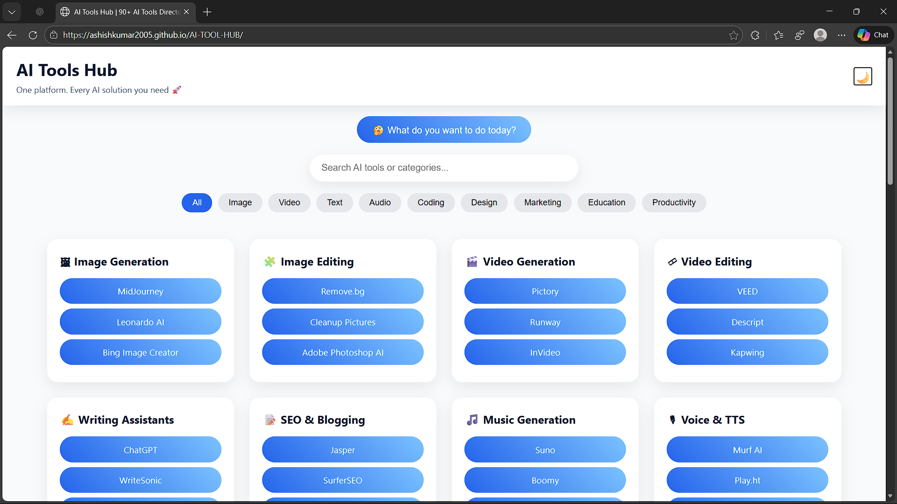
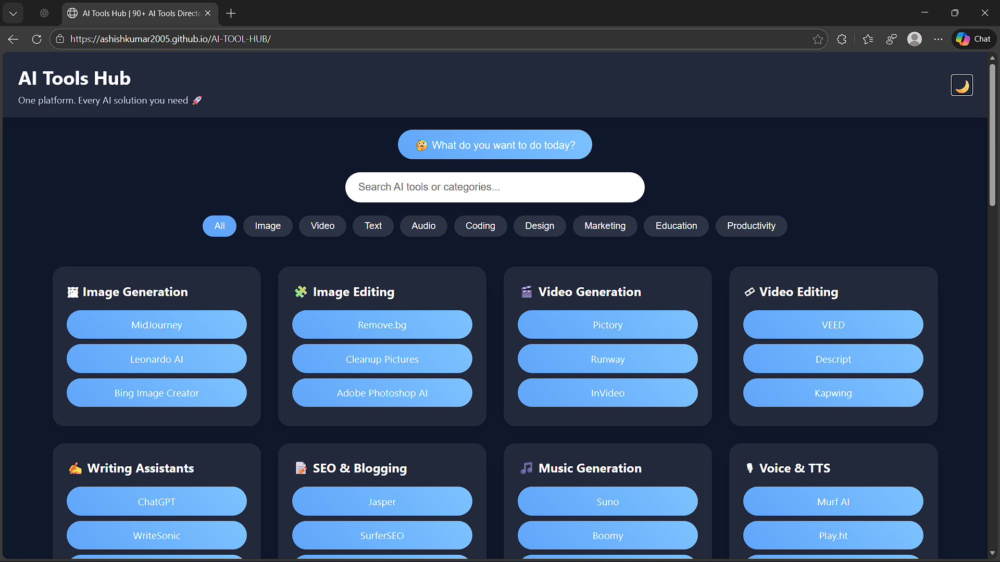
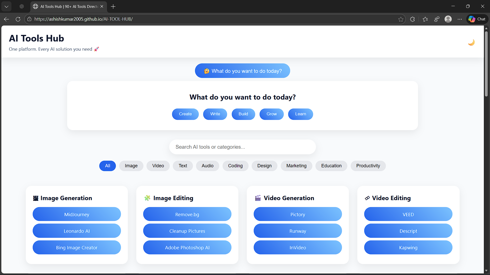

## AI Tools Hub
-A modern, responsive AI Tools Directory featuring 90+ AI tools across 30 categories, built using HTML, CSS, and JavaScript.
This project helps users quickly discover the right AI tools based on their needs — all in one place.

## Features
-Search AI tools instantly (real-time filtering)
-Category-based filtering (Image, Video, Text, Audio, Coding, etc.)
-Dark / Light mode toggle (theme saved in browser)
-Intent-based UX
### “What do you want to do today?” section with:
-Create
-Write
-Build
-Grow
-Learn
### Fully responsive (mobile, tablet, desktop)
-Fast & lightweight (no frameworks)
-30 AI categories × 90 tools
-No login, no ads, no distractions

## Live Website:
https://ashishkumar2005.github.io/AI-TOOL-HUB/

## Project Purpose
-First-year / college project
-Frontend development practice
-AI tools awareness platform
-GitHub portfolio project

## Screenshots
Homepage (Light Mode)

Homepage (Dark Mode)

What do you want to do today?” Section

